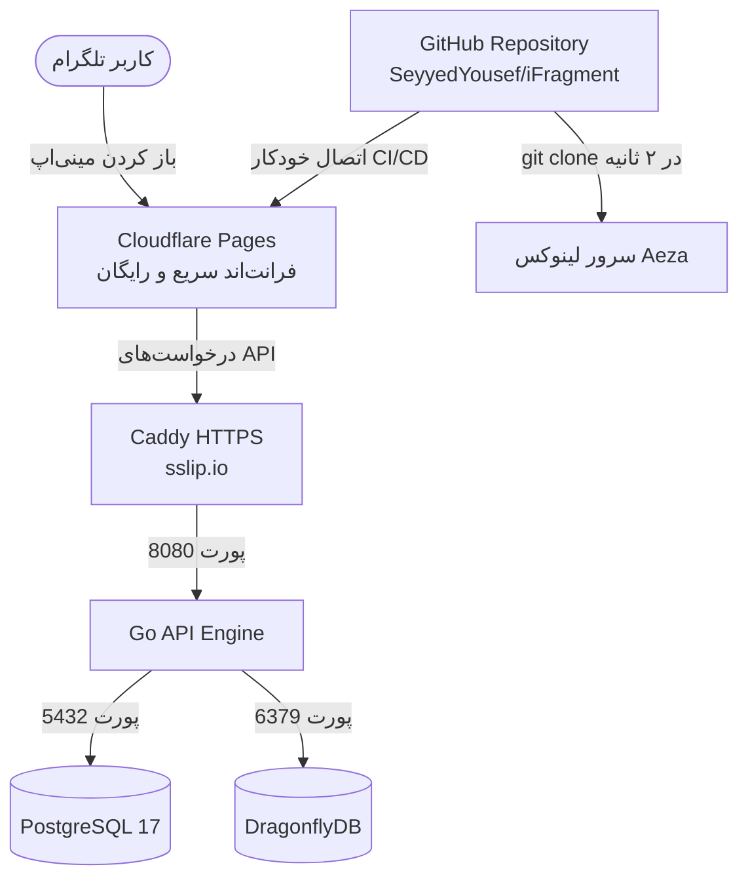

# 👑 راهنمای جامع و اختصاصی استقرار iFragment با گیت‌هاب (۰ تا ۱۰۰ بدون دردسر)

> **فرمول نهایی و استاندارد جهانی:**
> * **بک‌اند و دیتابیس:** کلون مستقیم از گیت‌هاب روی سرور **Aeza VPS** (با ۲ گیگ رم + ۲ گیگ Swap + داکر)
> * **فرانت‌اند:** اتصال خودکار ریپازیتوری گیت‌هاب به **Cloudflare Pages** (۱۰۰٪ رایگان و بدون اشغال منابع سرور)
> * **ریپازیتوری اختصاصی شما:** `https://github.com/SeyyedYousef/iFragment.git`

---

## 🗺️ نقشه معماری سیستم



---

## 📌 بخش اول: خرید سرور از Aeza (زمان: ۲ دقیقه)

1. وارد سایت **[aeza.net](https://aeza.net)** شده و ثبت‌نام کنید.
2. از منوی سرویس‌ها روی **Virtual Servers (VPS)** کلیک کنید.
3. مشخصات زیر را انتخاب کنید:
   * **لوکیشن (Location):** `Germany (Frankfurt / Falkenstein)` یا `Finland`
   * **پلن سرور (Plan):** `DEs-1` (قیمت: ~۵.۹۳ یورو / ۱ هسته / ۲ گیگ رم / ۳۰ گیگ NVMe)
   * **سیستم‌عامل (Operating System):** `Ubuntu 24.04` (۶۴ بیت)
4. صورت‌حساب را با کریپتو (Tether USDT یا TON) پرداخت کنید.
5. پس از ۲ دقیقه، مشخصات سرور را یادداشت کنید:
   * **آی‌پی سرور (IP):** مثلاً `185.220.100.50`
   * **نام کاربری:** `root`
   * **رمز عبور (Password):** مثلاً `AbC!1234#XyZ`

---

## 📌 بخش دوم: اتصال به سرور از ویندوز با PowerShell

1. در ویندوز برنامه **PowerShell** یا **cmd** را باز کنید.
2. دستور زیر را وارد کرده و Enter بزنید (آی‌پی سرور خود را بگذارید):
   ```bash
   ssh root@185.220.100.50
   ```
3. در پیام اول بنویسید **`yes`** و اینتر بزنید.
4. رمز عبور سرور را Paste کرده و اینتر بزنید (کاراکترها روی صفحه نشان داده نمی‌شوند که طبیعی است).

حالا داخل محیط سرور لینوکس هستید! 🟢

---

## 📌 بخش سوم: آماده‌سازی اولیه سرور (با یک دستور)

این دستورات را در ترمینال سرور کپی و اینتر کنید تا حافظه کمکی Swap، داکر و فایروال نصب شوند:

```bash
# ساخت حافظه مجازی 2 گیگابایتی Swap
fallocate -l 2G /swapfile && chmod 600 /swapfile && mkswap /swapfile && swapon /swapfile && echo '/swapfile none swap sw 0 0' >> /etc/fstab

# آپدیت سیستم و نصب ابزارهای مورد نیاز
apt-get update -y && apt-get install -y curl wget git ufw htop ca-certificates gnupg nano

# نصب رسمی Docker و Docker Compose
curl -fsSL https://get.docker.com | sh
systemctl enable docker && systemctl start docker

# تنظیم فایروال
ufw allow OpenSSH
ufw allow 80/tcp
ufw allow 443/tcp
ufw allow 8080/tcp
ufw --force enable
```

---

## 📌 بخش چهارم: دانلود پروژه از گیت‌هاب در ۳ ثانیه (Git Clone) ⚡

به جای آپلود دستی فایل‌های سنگین، این دستور را در سرور اجرا کنید تا تمام کدهای پروژه مستقیماً از گیت‌هاب دانلود شوند:

```bash
git clone https://github.com/SeyyedYousef/iFragment.git /opt/ifragment
```

*(سرور با پهنای باند ۲۵ گیگابیتی خود در کمتر از ۳ ثانیه کل کدهای پروژه را دانلود می‌کند).*

---

## 📌 بخش پنجم: تنظیم دامنه و SSL رایگان (بدون خرید دامنه!)

۱. وب‌سرور **Caddy** را روی سرور نصب می‌کنیم:
```bash
apt install -y debian-keyring debian-archive-keyring apt-transport-https curl
curl -1sLf 'https://dl.cloudsmith.io/public/caddy/stable/gpg.key' | gpg --dearmor -o /usr/share/keyrings/caddy-stable-archive-keyring.gpg
curl -1sLf 'https://dl.cloudsmith.io/public/caddy/stable/debian.deb.txt' | tee /etc/apt/sources.list.d/caddy-stable.list
apt update && apt install -y caddy
```

۲. تنظیم فایل کانفیگ Caddy:
```bash
nano /etc/caddy/Caddyfile
```
۳. تمام متن‌های داخل آن را پاک کرده و این کد را قرار دهید:
*(اگر آی‌پی شما `185.220.100.50` است، نقطه‌ها را تبدیل به خط تیره کنید)*

```caddy
185-220-100-50.sslip.io {
    reverse_proxy localhost:8080
}
```

۴. ذخیره با `Ctrl + O` و خروج با `Ctrl + X`.
۵. راه‌اندازی Caddy:
```bash
systemctl restart caddy
```
آدرس دامنه امن بک‌اند شما فعال شد: `https://185-220-100-50.sslip.io`

---

## 📌 بخش ششم: تنظیم فایل رمزها و مقادیر (`.env`)

در ترمینال سرور دستورات زیر را بزنید:

```bash
cd /opt/ifragment
cp .env.example .env
nano .env
```

مقادیر زیر را به دقت داخل فایل تنظیم کنید:

```env
# ─── وضعیت سرور ───────────────────────────
APP_ENV=production
PORT=8080

# ─── امنیت و توکن‌ها (کلیدهای تصادفی) ─────
JWT_SECRET=c8f2b3e4a5d6e7f8a9b0c1d2e3f4a5b6c7d8e9f0a1b2c3d4e5f6a7b8c9d0e1f2
WEBHOOK_SECRET_TOKEN=my_secure_telegram_token_2026
BOT_TOKEN_KEY=k9m2p4v7x1z3q5w8r0t2y4u6i8o0a1s3

# ─── توکن‌های ربات تلگرام (از BotFather) ──
BOT_TOKEN=7778889999:AAHxxxxxxxxxxxxxxxxxxxxxx
TELEGRAM_BOT_TOKEN=7778889999:AAHxxxxxxxxxxxxxxxxxxxxxx

# ─── پایگاه داده ──────────────────────────
POSTGRES_USER=ifragment_user
POSTGRES_PASSWORD=SecureDbPass2026!
POSTGRES_DB=ifragment

# ─── دامنه‌ها (آدرس sslip شما) ─────────────
ALLOWED_ORIGINS=*
APP_URL=https://185-220-100-50.sslip.io
```

ذخیره با `Ctrl + O` و خروج با `Ctrl + X`.

---

## 📌 بخش هفتم: روشن کردن کل سیستم با داکر 🚀

در همان مسیر `/opt/ifragment` این دستور را اجرا کنید:

```bash
docker compose -f docker-compose.prod.yml up -d --build
```

این دستور دیتابیس PostgreSQL 17، کش Dragonfly و بک‌اند Go را اجرا و جداول را خودکار می‌سازد.

### 🔍 بررسی صحت کارکرد:
```bash
# مشاهده وضعیت سالم بودن کانتینرها
docker compose -f docker-compose.prod.yml ps

# تست زنده اتصال دیتابیس و سلامت API
curl http://localhost:8080/api/v1/healthz/ready
```
*(دریافت پاسخ `{"status":"ok"}` یعنی سیستم ۱۰۰٪ آماده و سالم است).*

---

## 📌 بخش هشتم: راه‌اندازی فرانت‌اند در Cloudflare Pages (رایگان با گیت‌هاب)

1. وارد **[dash.cloudflare.com](https://dash.cloudflare.com)** شوید.
2. از منوی سمت چپ به **Workers & Pages** > **Overview** بروید.
3. روی **Create application** و سپس تب **Pages** کلیک کنید.
4. گزینه **Connect to Git** را بزنید و ریپازیتوری **`SeyyedYousef/iFragment`** را انتخاب کنید.
5. تنظیمات بیلد را وارد کنید:
   * **Framework preset:** `Vite`
   * **Root directory:** `frontend`
   * **Build command:** `npm install -g pnpm && pnpm install && pnpm run build`
   * **Build output directory:** `dist`
6. در بخش **Environment variables** این متغیر را اضافه کنید:
   * **نام متغیر:** `VITE_API_URL`
   * **مقدار متغیر:** `https://185-220-100-50.sslip.io/api/v1`
7. روی **Save and Deploy** کلیک کنید.

سایت فرانت‌اند شما در دامنه‌ای مثل **`https://ifragment.pages.dev`** با بالاترین سرعت دنیا بالا می‌آید! 🌐

---

## 📌 بخش نهم: اتصال نهایی به ربات تلگرام

۱. در تلگرام وارد **[@BotFather](https://t.me/BotFather)** شوید.
2. از مسیر `/mybots` > انتخاب ربات > **Bot Settings** > **Menu Button**، آدرس فرانت‌اند را وارد کنید:
   ```
   https://ifragment.pages.dev
   ```
3. برای ثبت وب‌هوک تلگرام به بک‌اند، این دستور را اجرا کنید:
   ```bash
   curl -F "url=https://185-220-100-50.sslip.io/api/v1/telegram/webhook" -F "secret_token=my_secure_telegram_token_2026" https://api.telegram.org/bot<YOUR_BOT_TOKEN>/setWebhook
   ```

---

## 🔄 نحوه آپدیت کردن پروژه در آینده (کاملاً خودکار با GitHub Actions)

سیستم CI/CD اختصاصی پروژه شما فعال شد! از این پس برای آپدیت کل پروژه حتی نیاز به باز کردن ترمینال سرور هم ندارید:

### 🔑 تنظیم یک‌بار برای همیشه در گیت‌هاب (زمان: ۱ دقیقه):
1. وارد صفحه ریپازیتوری خود در GitHub شوید: `https://github.com/SeyyedYousef/iFragment`
2. به تب **Settings** (تنظیمات بالای صفحه) بروید.
3. از منوی سمت چپ، روی **Secrets and variables** > سپس **Actions** کلیک کنید.
4. روی دکمه سبز **New repository secret** بزنید و این ۲ مورد را اضافه کنید:
   * **Secret اول:**
     * **Name:** `VPS_HOST`
     * **Secret:** آی‌پی سرور شما (مثلاً `185.220.100.50`)
   * **Secret دوم:**
     * **Name:** `VPS_PASSWORD`
     * **Secret:** رمز عبور سرور شما

---

### 🎉 از این به بعد:
تنها کاری که باید انجام دهید این است که در کامپیوترتان کد بنویسید و دستور `git push` را بزنید:
* **فرانت‌اند:** Cloudflare Pages به طور خودکار مینی‌اپ را آپدیت می‌کند.
* **بک‌اند:** ربات GitHub Actions به سرور وصل شده و کانتینرهای داکر را در ۲ ثانیه به‌روزرسانی می‌کند.

**شما دیگر نیاز به هیچ کار دستی نخواهید داشت! 🚀**
