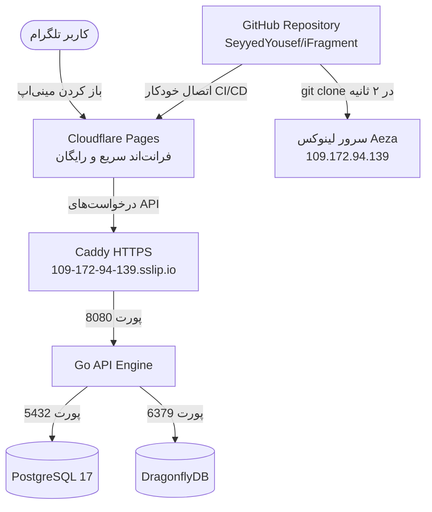

# 👑 راهنمای جامع استقرار iFragment روی سرور اختصاصی (از صفر تا صد)

> **آخرین به‌روزرسانی:** ۲۲ آگوست ۲۰۲۶
>
> **فرمول نهایی:**
> * **بک‌اند و دیتابیس:** سرور **Aeza VPS** آلمان (۲ گیگ رم + Swap + داکر)
> * **فرانت‌اند:** **Cloudflare Pages** (۱۰۰٪ رایگان، بدون اشغال منابع سرور)
> * **ریپازیتوری:** `https://github.com/SeyyedYousef/iFragment.git`

---

## 🗺️ نقشه معماری سیستم



---

## 📌 مرحله صفر: پاک‌سازی کامل سرور (فقط اگر قبلاً چیزی نصب کرده‌اید)

> **⚠️ توجه:** اگر سرور شما تازه خریداری شده و هیچ‌چیز روی آن نصب نکرده‌اید، این مرحله را **رد کنید** و مستقیم به مرحله ۱ بروید.

اگر قبلاً تلاشی برای نصب داشتید و می‌خواهید از صفر شروع کنید، این دستورات را در ترمینال سرور اجرا کنید:

```bash
docker compose -f /opt/ifragment/docker-compose.prod.yml down -v --rmi all 2>/dev/null
docker system prune -af --volumes
rm -rf /opt/ifragment
```

**توضیح:** این دستورات تمام کانتینرهای داکر، ایمیج‌ها، دیتابیس‌ها و کدهای قبلی را کامل پاک می‌کنند تا سرور به حالت تمیز برگردد.

---

## 📌 مرحله ۱: ورود به سرور از ویندوز

### ۱.۱ باز کردن ترمینال ویندوز
* در ویندوز، کلیدهای **`Win + R`** را فشار دهید.
* در پنجره باز شده بنویسید **`cmd`** و Enter بزنید.
* یک پنجره سیاه‌رنگ (Command Prompt) باز می‌شود.

### ۱.۲ اتصال به سرور با SSH
* در این پنجره سیاه، دستور زیر را تایپ کنید و **Enter** بزنید:

```bash
ssh root@109.172.94.139
```

### ۱.۳ تأیید اثرانگشت سرور (فقط بار اول)
* اگر پیامی مشابه زیر آمد:
  ```
  Are you sure you want to continue connecting (yes/no/[fingerprint])?
  ```
* کلمه **`yes`** را بنویسید و **Enter** بزنید.

### ۱.۴ وارد کردن رمز عبور
* وقتی عبارت `root@109.172.94.139's password:` ظاهر شد:
  1. به پنل Aeza بروید (سایت my.aeza.net) و روی دکمه **کپی** کنار Password کلیک کنید.
  2. به پنجره سیاه CMD برگردید.
  3. داخل پنجره سیاه **یک بار کلیک‌راست** ماوس کنید (با این کار پسورد پیست می‌شود).
  4. کلید **Enter** را فشار دهید.

> **⚠️ نکته مهم:** هنگام وارد کردن رمز عبور، هیچ ستاره‌ای (***) یا کاراکتری روی صفحه نمایش داده نمی‌شود. این رفتار طبیعی و امنیتی لینوکس است. فقط پیست کنید و Enter بزنید.

> **⚠️ نکته مهم:** اگر خطای `Permission denied` دریافت کردید، ابتدا پسورد را در برنامه Notepad ویندوز پیست کنید تا مطمئن شوید فاصله اضافی (Space) اول یا آخر آن نباشد. سپس دوباره امتحان کنید.

### ۱.۵ ورود موفق
اگر عبارتی شبیه `root@vicarious-plum:~#` دیدید، یعنی با موفقیت وارد سرور شدید! 🟢

---

## 📌 مرحله ۲: ساخت حافظه مجازی Swap

سرور شما ۲ گیگابایت رم دارد. برای اینکه هنگام کامپایل کد Go حافظه کم نیاید، یک فضای مجازی ۴ گیگابایتی (Swap) می‌سازیم.

**دستور زیر را کامل کپی کنید، در ترمینال سرور کلیک‌راست کنید و Enter بزنید:**

```bash
fallocate -l 4G /swapfile && chmod 600 /swapfile && mkswap /swapfile && swapon /swapfile
```

سپس این دستور را هم اجرا کنید تا بعد از ریستارت سرور هم Swap فعال بماند:

```bash
grep -q '/swapfile' /etc/fstab || echo '/swapfile none swap sw 0 0' >> /etc/fstab
```

**تأیید:** با اجرای دستور زیر مطمئن شوید Swap فعال شده:
```bash
free -h
```
در خروجی باید ردیف **Swap** مقدار **4.0Gi** نشان دهد.

---

## 📌 مرحله ۳: آپدیت سیستم و نصب ابزارهای پایه

```bash
apt-get update -y && apt-get install -y curl wget git ufw htop ca-certificates gnupg nano
```

**توضیح:** این دستور سیستم‌عامل را به‌روزرسانی کرده و ابزارهای ضروری (Git برای دانلود کد، nano برای ویرایش فایل، curl برای تست و ...) را نصب می‌کند.

---

## 📌 مرحله ۴: نصب Docker و Docker Compose

```bash
curl -fsSL https://get.docker.com | sh
```

صبر کنید تا نصب تمام شود (حدود ۱ دقیقه). سپس داکر را فعال کنید:

```bash
systemctl enable docker && systemctl start docker
```

**تأیید:** با اجرای دستور زیر مطمئن شوید داکر نصب شده:
```bash
docker --version
```
باید خروجی شبیه `Docker version 28.x.x` ببینید.

---

## 📌 مرحله ۵: تنظیم فایروال (دیوار آتش)

```bash
ufw allow OpenSSH
ufw allow 80/tcp
ufw allow 443/tcp
ufw allow 8080/tcp
ufw --force enable
```

**توضیح:** این دستورات فقط پورت‌های لازم (SSH برای اتصال شما، HTTP/HTTPS برای وب، و ۸۰۸۰ برای بک‌اند) را باز می‌کنند و بقیه پورت‌ها را مسدود می‌کنند.

---

## 📌 مرحله ۶: دانلود پروژه از گیت‌هاب

```bash
git clone https://github.com/SeyyedYousef/iFragment.git /opt/ifragment
```

**توضیح:** تمام کدهای پروژه مستقیماً از گیت‌هاب در پوشه `/opt/ifragment` دانلود می‌شوند. سرور با پهنای باند ۲۵ گیگابیتی خود در چند ثانیه این کار را انجام می‌دهد.

**تأیید:** با اجرای دستور زیر مطمئن شوید فایل‌ها دانلود شدند:
```bash
ls /opt/ifragment/
```
باید فایل‌هایی مثل `docker-compose.prod.yml`، `backend/`، `frontend/` و ... را ببینید.

---

## 📌 مرحله ۷: نصب Caddy (وب‌سرور HTTPS رایگان)

Caddy یک وب‌سرور است که به‌صورت خودکار برای سرور شما گواهی SSL (قفل سبز مرورگر) دریافت می‌کند. بدون نیاز به خرید دامنه!

### ۷.۱ نصب Caddy

```bash
apt install -y debian-keyring debian-archive-keyring apt-transport-https curl
curl -1sLf 'https://dl.cloudsmith.io/public/caddy/stable/gpg.key' | gpg --dearmor -o /usr/share/keyrings/caddy-stable-archive-keyring.gpg
curl -1sLf 'https://dl.cloudsmith.io/public/caddy/stable/debian.deb.txt' | tee /etc/apt/sources.list.d/caddy-stable.list
apt update && apt install -y caddy
```

### ۷.۲ تنظیم Caddy

دستور زیر را اجرا کنید تا فایل تنظیمات Caddy به‌صورت خودکار ساخته شود:

```bash
cat << 'CADDYEOF' > /etc/caddy/Caddyfile
109-172-94-139.sslip.io {
    reverse_proxy localhost:8080
}
CADDYEOF
```

### ۷.۳ راه‌اندازی Caddy

```bash
systemctl restart caddy
```

**توضیح:** از این لحظه آدرس `https://109-172-94-139.sslip.io` فعال شده و هر درخواستی که به آن برسد را به بک‌اند (پورت ۸۰۸۰) هدایت می‌کند. سرویس `sslip.io` یک DNS رایگان است که آی‌پی شما را به یک دامنه تبدیل می‌کند.

---

## 📌 مرحله ۸: ساخت فایل تنظیمات `.env`

### ۸.۱ ویرایشگر nano را باز کنید

```bash
nano /opt/ifragment/.env
```

یک صفحه خالی (یا تقریباً خالی) باز می‌شود.

### ۸.۲ محتوای فایل `.env`

متن زیر را **کامل کپی** کنید، سپس در ترمینال سرور **یک بار کلیک‌راست** کنید تا پیست شود:

```env
# وضعیت سرور و آدرس‌ها
APP_ENV=production
PORT=8080
APP_URL=https://109-172-94-139.sslip.io
ALLOWED_ORIGINS=*

# امنیت و توکن‌ها
JWT_SECRET=mySuperSecretSecretForIFragment2026
BOT_TOKEN_KEY=a1b2c3d4e5f6g7h8i9j0k1l2m3n4o5p6
WEBHOOK_SECRET_TOKEN=Telegram

# ربات تلگرام و مالک
BOT_TOKEN=<توکن ربات تلگرام از BotFather>
OWNER_PASSWORD=<رمز عبور پنل ادمین>
OWNER_TELEGRAM_IDS=<آیدی عددی تلگرام مالک>

# تاپیک‌های گروه ادمین
ADMIN_GROUP_ID=<آیدی عددی گروه ادمین>
ADMIN_TOPIC_AVM=50
ADMIN_TOPIC_NEW_BOT=53
ADMIN_TOPIC_NEW_CHANNEL=54
ADMIN_TOPIC_PAYMENTS=52

# سرویس‌های متصل
TONAPI_KEY=<کلید TonAPI>
GROQ_API_KEY=<کلید Groq>
MARKETAPP_TOKEN=<توکن MarketApp>

# مشخصات دیتابیس داخلی داکر (این مقادیر فقط برای دیتابیس محلی روی سرور هستند)
POSTGRES_USER=ifragment_user
POSTGRES_PASSWORD=SecureDbPass2026!
POSTGRES_DB=ifragment
```

> **⚠️ توجه:** مقادیری که با `<...>` مشخص شده‌اند باید با مقادیر واقعی خودتان جایگزین شوند. این مقادیر را از فایل `.env` فعلی پروژه (روی Render یا کامپیوتر خودتان) کپی کنید.

### ۸.۳ ذخیره و خروج

1. کلیدهای **`Ctrl + O`** را فشار دهید (ذخیره فایل).
2. کلید **`Enter`** را بزنید (تأیید نام فایل).
3. کلیدهای **`Ctrl + X`** را فشار دهید (خروج از ویرایشگر).

---

## 📌 مرحله ۹: روشن کردن کل سیستم با داکر 🚀

### ۹.۱ اجرای بیلد و استارت

```bash
cd /opt/ifragment
docker compose -f docker-compose.prod.yml up -d --build
```

**توضیح:** این دستور سه کار انجام می‌دهد:
1. **دیتابیس PostgreSQL 17** را دانلود و اجرا می‌کند.
2. **کش DragonflyDB** را دانلود و اجرا می‌کند.
3. **کدهای Go بک‌اند** را کامپایل کرده و به‌صورت یک سرویس اجرا می‌کند.

> **⏱️ زمان انتظار:** بار اول بین **۵ تا ۱۰ دقیقه** طول می‌کشد (به دلیل کامپایل کدهای Go روی ۱ هسته CPU). لطفاً صبر کنید و ترمینال را نبندید. وقتی خط فرمان `root@vicarious-plum:/opt/ifragment#` دوباره ظاهر شد، یعنی کار تمام شده.
>
> **نکته:** دفعات بعدی (آپدیت‌های آینده) این بیلد فقط ۲ تا ۵ ثانیه طول می‌کشد چون Docker از کش استفاده می‌کند.

### ۹.۲ بررسی وضعیت سرویس‌ها

```bash
docker compose -f docker-compose.prod.yml ps
```

**خروجی مورد انتظار:** باید ۳ سرویس زیر را با وضعیت **Up** و **(healthy)** ببینید:
| نام سرویس | وضعیت مورد انتظار |
|---|---|
| ifragment-api-1 | Up (healthy) |
| ifragment-db-1 | Up (healthy) |
| ifragment-dragonfly-1 | Up (healthy) |

### ۹.۳ تست سلامت API

```bash
curl http://localhost:8080/api/v1/healthz/ready
```

**خروجی مورد انتظار:**
```json
{"status":"ok"}
```

اگر این پاسخ را دریافت کردید، بک‌اند شما ۱۰۰٪ سالم و آماده است! 🎉

### ۹.۴ عیب‌یابی (اگر مشکلی بود)

اگر یکی از سرویس‌ها وضعیت **Restarting** یا **Unhealthy** داشت، لاگ‌های آن سرویس را بررسی کنید:

```bash
# لاگ بک‌اند
docker logs ifragment-api-1 --tail 50

# لاگ دیتابیس
docker logs ifragment-db-1 --tail 50

# لاگ کش
docker logs ifragment-dragonfly-1 --tail 50
```

---

## 📌 مرحله ۱۰: راه‌اندازی فرانت‌اند در Cloudflare Pages

### ۱۰.۱ ایجاد حساب Cloudflare (اگر ندارید)
1. به آدرس **[dash.cloudflare.com](https://dash.cloudflare.com)** بروید.
2. با ایمیل جدید ثبت‌نام کنید (کاملاً رایگان).

### ۱۰.۲ ساخت پروژه جدید
1. بعد از ورود، در منوی **سمت چپ** صفحه روی **Workers & Pages** کلیک کنید.
2. روی دکمه آبی **Create** کلیک کنید.
3. تب **Pages** را انتخاب کنید (نه Workers!).
4. روی **Connect to Git** کلیک کنید.
5. حساب GitHub خود را متصل کنید و ریپازیتوری **`SeyyedYousef/iFragment`** را انتخاب کنید.

### ۱۰.۳ تنظیمات بیلد (بسیار مهم ⚠️)

در صفحه تنظیمات بیلد، فیلدهای زیر را **دقیقاً** پر کنید:

| فیلد | مقدار |
|---|---|
| **Framework preset** | `None` |
| **Root directory** | `frontend` |
| **Build command** | `npm install -g pnpm && pnpm install && pnpm run build` |
| **Build output directory** | `dist` |

### ۱۰.۴ اضافه کردن متغیر محیطی (Environment Variable)

در همین صفحه، بخش **Environment variables** را پیدا کنید و روی **Add variable** کلیک کنید:

| نام متغیر (Variable name) | مقدار (Value) |
|---|---|
| `VITE_API_URL` | `https://109-172-94-139.sslip.io/api/v1` |

### ۱۰.۵ دیپلوی
روی دکمه **Save and Deploy** کلیک کنید.

**⏱️ زمان انتظار:** حدود ۲ تا ۳ دقیقه طول می‌کشد تا Cloudflare فرانت‌اند را بیلد و دیپلوی کند.

**نتیجه:** پس از اتمام، آدرس فرانت‌اند شما چیزی شبیه این خواهد بود:
```
https://ifragment-xxxx.pages.dev
```
این آدرس را یادداشت کنید، در مرحله بعد به آن نیاز دارید.

---

## 📌 مرحله ۱۱: اتصال ربات تلگرام

### ۱۱.۱ تنظیم Menu Button در BotFather
1. در تلگرام وارد **[@BotFather](https://t.me/BotFather)** شوید.
2. دستور `/mybots` را بفرستید.
3. ربات خود را انتخاب کنید.
4. روی **Bot Settings** کلیک کنید.
5. روی **Menu Button** کلیک کنید.
6. روی **Configure menu button** کلیک کنید.
7. آدرس فرانت‌اند خود را از مرحله ۱۰ وارد کنید (مثلاً `https://ifragment-xxxx.pages.dev`).
8. متن دلخواه برای دکمه وارد کنید (مثلاً `Open App`).

### ۱۱.۲ ثبت Webhook تلگرام

به ترمینال سرور برگردید و دستور زیر را اجرا کنید (توکن ربات و secret خود را جایگزین کنید):

```bash
curl -F "url=https://109-172-94-139.sslip.io/api/v1/telegram/webhook" \
     -F "secret_token=<مقدار WEBHOOK_SECRET_TOKEN از فایل env>" \
     "https://api.telegram.org/bot<توکن ربات تلگرام>/setWebhook"
```

**خروجی مورد انتظار:**
```json
{"ok":true,"result":true,"description":"Webhook was set"}
```

---

## 📌 مرحله ۱۲: تنظیم آپدیت خودکار با GitHub Actions

این تنظیم **فقط یک‌بار** انجام می‌شود و بعد از آن، هر بار که `git push` بزنید، سرور به‌صورت خودکار آپدیت می‌شود.

### ۱۲.۱ اضافه کردن Secretها در گیت‌هاب
1. به آدرس `https://github.com/SeyyedYousef/iFragment` بروید.
2. روی تب **Settings** (بالای صفحه) کلیک کنید.
3. در منوی سمت چپ، روی **Secrets and variables** کلیک کنید.
4. سپس روی **Actions** کلیک کنید.
5. روی دکمه سبز **New repository secret** بزنید.

**Secret اول:**
* **Name:** `VPS_HOST`
* **Secret:** `109.172.94.139`

**Secret دوم:**
* **Name:** `VPS_PASSWORD`
* **Secret:** رمز عبور سرور شما (که از پنل Aeza کپی کردید)

### ۱۲.۲ از این به بعد
تنها با اجرای یک دستور `git push` در کامپیوترتان:
* **فرانت‌اند:** Cloudflare Pages بلافاصله مینی‌اپ را بیلد و آپدیت می‌کند.
* **بک‌اند:** GitHub Actions به سرور وصل شده و کانتینرهای داکر را به‌روزرسانی می‌کند.

---

## 🔧 دستورات مفید برای مدیریت سرور

| کار | دستور |
|---|---|
| مشاهده وضعیت سرویس‌ها | `docker compose -f docker-compose.prod.yml ps` |
| مشاهده لاگ بک‌اند (زنده) | `docker logs -f ifragment-api-1` |
| ریستارت همه سرویس‌ها | `docker compose -f docker-compose.prod.yml restart` |
| آپدیت دستی از گیت‌هاب | `cd /opt/ifragment && git pull && docker compose -f docker-compose.prod.yml up -d --build` |
| تست سلامت API | `curl http://localhost:8080/api/v1/healthz/ready` |
| مشاهده مصرف حافظه | `free -h` |
| مشاهده فضای دیسک | `df -h` |
