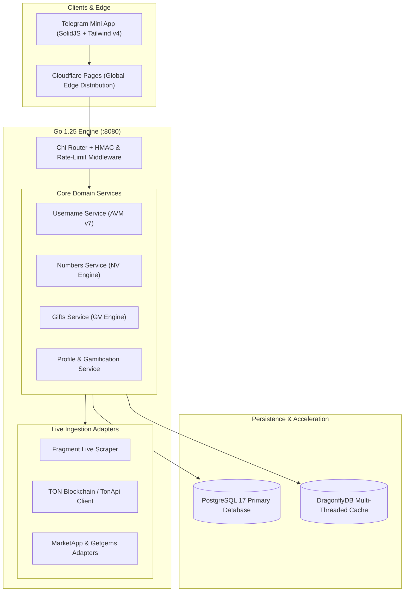

<div align="center">

# 💎 iFragment

### The Institutional Valuation & Market Intelligence Platform for Telegram Assets

[](https://golang.org)
[](https://solidjs.com)
[](https://postgresql.org)
[](https://dragonflydb.io)
[](https://core.telegram.org/bots/webapps)
[](#-internationalization-i18n)
[](PRODUCTION.md)

<p align="center">
  <b>iFragment</b> is a high-performance Telegram Mini App (TMA) and institutional intelligence engine engineered for real-time valuation, on-chain provenance tracking, arbitrage detection, and auction analytics across the entire Telegram asset ecosystem on the TON Blockchain.
</p>

[Explore Engines](#-three-core-intelligence-engines) •
[Architecture](#-system-architecture) •
[Quickstart](#-quick-start--local-development) •
[Production Deployment](PRODUCTION.md) •
[API Reference](#-api--integration-contracts)

---

</div>

## 🌟 Key Highlights & Engineering Standards

- **120 FPS Mobile Experience:** Built with [SolidJS](https://solidjs.com) (Zero Virtual DOM overhead) for hyper-responsive mobile WebView rendering within Telegram.
- **Microsecond Backend Engine:** Microservices-clean architecture implemented in **Go 1.25** with raw connection pooling and memory recycling.
- **Zero Mock Policy (100% Real-Time Data):** Direct on-chain ingestion from TON LiteServers, TonApi, Telemint smart contracts, and decentralized marketplace scrapers (Fragment, Getgems, Tonano, MarketApp).
- **100 Idempotent Migrations:** PostgreSQL 17 transactional database with automated safe schema evolution, keyset pagination, and partitioned audit logs.
- **Quad-Language Parity (i18n):** Complete native support for English (`en`), Persian (`fa`), Russian (`ru`), and Chinese (`zh`) with full 3,438-key parity.
- **Military-Grade Security:** Native Telegram `initData` HMAC-SHA256 signature verification, AES-256 encrypted session tokens, and strict PII log-masking.

---

## 🔬 Three Core Intelligence Engines

```
                                  ┌──────────────────────────────┐
                                  │      iFragment Core API      │
                                  └──────────────┬───────────────┘
                     ┌───────────────────────────┼───────────────────────────┐
                     ▼                           ▼                           ▼
        ┌─────────────────────────┐ ┌─────────────────────────┐ ┌─────────────────────────┐
        │       AVM Engine        │ │        NV Engine        │ │        GV Engine        │
        │   (Telegram Usernames)  │ │   (Anonymous Numbers)   │ │    (Telegram Gifts)     │
        └─────────────────────────┘ └─────────────────────────┘ └─────────────────────────┘
```

### 1. 🔤 AVM Engine — Automated Valuation Model v7.0 (Usernames)
Empirical valuation engine calibrated against historical Fragment auction settlements:
- **Bayesian Estimator:** Multi-variable regression incorporating length, dictionary status, word frequency, phonetic cadence, and brand affinity.
- **Telemint On-Chain Provenance:** Direct inspection of TEP-62 smart contracts on TON to verify minted NFT ownership, royal distribution, and past bid transactions.
- **Anti-Phishing & Homoglyph Twins Radar:** Detects spoofed unicode lookalikes, Cyrillic/Latin homoglyphs, and trademark infringement risks under Telegram ToS §4.
- **Transaction Economics Breakdown:** Accurate calculations of gross valuation, Fragment 5% protocol fee (minimum 5 TON), and estimated seller net payouts.

### 2. 📱 NV Engine — Mathematical Valuation Engine (Numbers +888)
Dedicated quantitative analyzer for Telegram Anonymous Numbers:
- **Genesis vs. Standard Tiers:** Distinct valuation logic for ultra-rare 4-digit Genesis numbers (`+888 8000`–`+888 8999`, supply frozen forever) versus 8-digit Standard series.
- **Mathematical Pattern Scarcity:** Real-time classification for palindromes, repetitions (`AAAA`, `ABAB`, `AABB`), ladders, and auspicious sequences.
- **Cross-Cultural Affinity Matrices:** Quantitative demand scoring for Sinosphere (8s/6s affinity, 4-avoidance), MENA/Gulf vanity codes, and European brevity.
- **On-Chain Whale & Volume Tape:** Live indexer tracking wallet concentration, floor price movements, and secondary sales on Getgems and Fragment.

### 3. 🎁 GV Engine — Multi-Venue Intelligence Engine (Telegram Gifts)
Comprehensive market aggregation and crafting optimization for Telegram Gifts:
- **120 Canonical Collections:** Complete registry of all Telegram gift collections, official supply caps, and base star prices.
- **Traits & Rarity Matrix:** Real-time rarity calculations for custom Backdrops (center, edge, pattern hexes) and Symbols.
- **Cross-Marketplace Arbitrage Radar:** Identifies profitable spreads between Fragment, Getgems, Tonano, and MarketApp while filtering wash-trade anomalies.
- **Crafting Expected Value (EV):** Monte Carlo EV simulator calculating optimal upgrade paths and stars-to-TON conversion yields.

---

## 🏛️ System Architecture



---

## 🌐 Internationalization (i18n)

iFragment features native localization across four primary languages, ensuring zero friction for global Telegram communities:

| Code | Language | Native Name | Script Direction | Key Count | Parity |
| :---: | :--- | :--- | :---: | :---: | :---: |
| `en` | English | English | LTR | 3,438 | 100% |
| `fa` | Persian | فارسی | RTL | 3,438 | 100% |
| `ru` | Russian | Русский | LTR | 3,438 | 100% |
| `zh` | Chinese | 简体中文 | LTR | 3,438 | 100% |

- **Reactive Locale Switching:** Automatically adapts to the user's Telegram client language or manual selection with persistent cloud preference.
- **Full Bidirectional Layouts:** Seamless switching between LTR and RTL styling with zero layout shifts.
- **Strict Verification Gate:** Validated via automated CI gate (`npm run check:i18n`).

---

## ⚡ Quick Start & Local Development

### Prerequisites
- [Node.js](https://nodejs.org) 20+ & [pnpm](https://pnpm.io) or `npm`
- [Go](https://go.dev) 1.25+
- [Docker & Docker Compose](https://www.docker.com) (for PostgreSQL 17 + DragonflyDB)

### 1. Clone the Repository
```bash
git clone https://github.com/SeyyedYousef/iFragment.git
cd iFragment
```

### 2. Configure Environment
```bash
cp .env.example .env
```

### 3. Spin Up Local Infrastructure
```bash
docker compose up -d postgres dragonfly
```

### 4. Run Frontend (Dev Server)
```bash
cd frontend
npm install
npm run dev
```
*Frontend starts at `http://localhost:3000` (or configured dev port).*

### 5. Run Backend (API Server)
```bash
cd backend
go run cmd/api/main.go
```
*API server starts at `http://localhost:8080`.*

---

## 🧪 Testing & Quality Assurance

Both frontend and backend are covered by comprehensive automated test suites:

```bash
# Run all backend unit & integration tests
cd backend
go test -v -race ./...

# Run all frontend tests (Vitest)
cd frontend
npm run test:run

# Verify i18n parity and string hygiene
npm run check:i18n

# Run Biome code quality audit
npm run lint
```

---

## 🚢 Production Deployment

For complete instructions regarding production deployment, reverse proxies, SSL configuration, and zero-downtime container updates, consult the [PRODUCTION.md](PRODUCTION.md) guide.

```bash
# Quick VPS deployment via Docker Compose
docker compose -f docker-compose.prod.yml up -d --build
```

---

## 🔒 Security & Privacy

- **Telegram initData Validation:** All client requests are authenticated using cryptographic HMAC-SHA256 signatures generated with the official bot token.
- **Zero Secrets in Source:** No API keys, database credentials, or sensitive seeds exist within version control.
- **PII Protection:** Automated log-masking prevents Telegram User IDs, phone numbers, and IP addresses from leaking into stdout or tracing telemetry.
- **Privacy Policy:** See [PRIVACY_POLICY.md](PRIVACY_POLICY.md) for data handling and compliance disclosures.

---

## 📄 License & Attribution

Developed with extreme precision for **Seyyed Yousef** ([@SeyyedYousef](https://github.com/SeyyedYousef)).  
All rights reserved © 2026 iFragment Platform.
