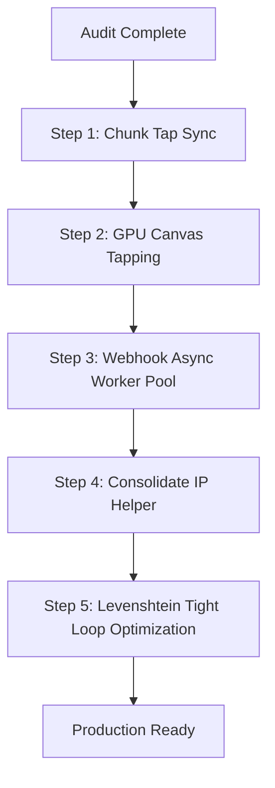

# iFragment Comprehensive Codebase Audit & Production Roadmap

This document outlines the architectural strengths, critical vulnerabilities, and a step-by-step production action plan for the **iFragment** Full-Stack ecosystem. 

---

## 📋 Overview
iFragment is a premium Web3 mini-app and Telegram bot ecosystem designed for collectible usernames, automated channel/group administration, and Web3 gamification (Tap-to-Earn). This audit deconstructs the system across its Go (backend) and SolidJS (frontend) codebases.

* **Project Type:** Full-Stack (Go backend, SolidJS frontend)
* **Goal:** High scalability (million-user level), bulletproof security (SecOps), buttery-smooth UX, and exact business-logic calculations.

---

## 🔍 Key Findings & Critical Vulnerabilities

### 1. The Game-Breaking Tap Rollback Bug (Critical UX/Functional Defect)
* **Location:** `frontend/src/shared/store/airdrop.ts` & `backend/internal/handler/profile.go`
* **Vulnerability:** The client debounce logic accumulates pointer down events in `pendingTaps` in memory/localStorage. When the user pauses tapping for 1.5 seconds, it fires a sync request `addTaps(tapsToSend)`. If a rapid clicker or multi-finger player does more than 50 taps before the pause, the payload contains `taps = 51+`.
* **Impact:** The backend strictly rejects taps above 50 (`Taps must be between 1 and 50`) returning HTTP 400. The frontend catch block triggers an *optimistic rollback*, calling `syncProfileStats()`. This silently resets the user's balance to the old server state, **wiping out their earned coins entirely**.

### 2. Synchronous Webhook Connection Starvation (Critical Scalability Bottleneck)
* **Location:** `backend/internal/handler/webhook.go`
* **Vulnerability:** The central webhook dispatcher processes callback queries, regular message moderations (which hit external APIs, perform multiple DB locks, and execute Telegram API calls like kicks/deletions), and payment updates **synchronously** inside the main HTTP handler.
* **Impact:** During high traffic, HTTP threads block waiting for database locks and Telegram HTTP requests to complete. This starves the connection pool and exceeds Telegram's 2-second timeout, prompting Telegram to retry the same webhook continuously. This creates a feedback loop of duplicate actions, 429 errors, and eventually crashes the server under million-user loads.

### 3. DOM Thrashing in Multi-Touch Clicker (Performance Bottleneck)
* **Location:** `frontend/src/pages/airdrop/airdrop/ui/TapView.tsx`
* **Vulnerability:** The clicker rendering mounts a new HTML DOM node for every pointer down particle, applying transitions, and scheduling individual timeouts to clean them up after 900ms.
* **Impact:** Rapid multi-touch tapping generates 15-30 active DOM elements per second. This triggers severe **DOM thrashing**, heavy garbage collection overhead, and frame drops (lag) inside the Telegram Webview on low-end/mid-range Android/iOS devices.

### 4. Dynamic Proxy IP Discrepancy & Auth Bypass (Security Vulnerability)
* **Location:** `backend/internal/middleware/tg_initdata.go` vs `backend/internal/handler/ip.go`
* **Vulnerability:** `tg_initdata.go` extracts the IP address for rate-limiting and brute-force protection directly using `r.RemoteAddr` instead of using the trusted proxy IP helper `handler.ClientIP(r)`.
* **Impact:** Behind Nginx/Cloudflare, `r.RemoteAddr` always returns the IP of the proxy. If a single malicious user brute-forces signatures, the IP lock will block the proxy IP, **locking out all legitimate users globally**. Conversely, attackers can spoof IP headers to bypass limits entirely.

### 5. Memory Allocations in Levenshtein Tight-Loop (CPU Bottleneck)
* **Location:** `backend/internal/service/username/similar.go`
* **Vulnerability:** The Levenshtein distance inner loop calls `minInt(values ...int)`.
* **Impact:** In Go, variadic parameters inside tight loops require slice allocation on the heap/stack. Running this hundreds of times per similarity request under high concurrency creates massive garbage collection pressure.

---

## 📊 Product Evaluation Score

| Dimension | Score | Comments |
| :--- | :---: | :--- |
| **Security & Hardening** | **85/100** | Cryptographic verification of InitData with HMAC-SHA256 and Subtle Constant-time comparison is excellent. Conditional build flags (`dev`/`prod`) are robust. The proxy IP discrepancy is the only weakness. |
| **Scalability & Concurrency** | **65/100** | Strict user-specific row locks prevent deadlocks, but synchronous webhook handlers and direct DB writes on every single tap flush will choke the DB pool at scale. |
| **UX & Visual Performance** | **70/100** | SolidJS signals are clean, but DOM-based particle rendering and the optimistic tap rollback bug degrade usability. |
| **Clean Code & Patterns** | **90/100** | Exceptional adherence to SOLID/DRY principles. Strongly decoupled repository, service, and handler layers. |
| **Overall Score** | **77.5/100** | **Ready for Staging, but requires the following fixes before lacing up for million-user Production.** |

---

## 🚀 100% Production Action Plan & Code Snippets



### Step 1: Chunk Frontend Tap Syncing
Modify the frontend store to chunk accumulated taps into safe, max-50 batches, satisfying the backend’s safety boundaries without resetting user progress.

#### [MODIFY] [airdrop.ts](file:///c:/Users/DEll/Desktop/iFragment/frontend/src/shared/store/airdrop.ts)
```diff
-export const syncPendingTaps = async () => {
-  if (pendingTaps <= 0) return;
-  const tapsToSend = pendingTaps;
-  try {
-    const stats = await addTaps(tapsToSend);
-    if (stats) {
-      setBalance(stats.airdropCoins || 0);
-      setEnergy(stats.energy !== undefined ? stats.energy : energy());
-      setFrgBalance(stats.frgBalance || 0);
-      setTotalTaps(stats.totalTaps || 0);
-      
-      pendingTaps = Math.max(0, pendingTaps - tapsToSend);
-      if (pendingTaps === 0) {
-        localStorage.removeItem('airdrop-pending-taps');
-      } else {
-        localStorage.setItem('airdrop-pending-taps', pendingTaps.toString());
-      }
-    }
-  } catch (e) {
-    // Optimistic rollback: synchronize local state back to server truth on failure
-    await syncProfileStats();
-    console.error("Failed to sync taps with server:", e);
-  }
-};
+export const syncPendingTaps = async () => {
+  if (pendingTaps <= 0) return;
+  
+  // Process and send in chunks of max 50 taps to satisfy backend SEC-08 limit
+  while (pendingTaps > 0) {
+    const tapsToSend = Math.min(pendingTaps, 50);
+    try {
+      const stats = await addTaps(tapsToSend);
+      if (stats) {
+        setBalance(stats.airdropCoins || 0);
+        setEnergy(stats.energy !== undefined ? stats.energy : energy());
+        setFrgBalance(stats.frgBalance || 0);
+        setTotalTaps(stats.totalTaps || 0);
+        
+        pendingTaps = Math.max(0, pendingTaps - tapsToSend);
+        if (pendingTaps === 0) {
+          localStorage.removeItem('airdrop-pending-taps');
+        } else {
+          localStorage.setItem('airdrop-pending-taps', pendingTaps.toString());
+        }
+      } else {
+        break;
+      }
+    } catch (e) {
+      // Optimistic rollback on actual server failure
+      await syncProfileStats();
+      console.error("Failed to sync taps with server:", e);
+      break;
+    }
+  }
+};
```

---

### Step 2: GPU-Accelerated Canvas for Smooth Tapping
Replace the heavy DOM particle instantiation with a lightweight, hardware-accelerated 2D HTML5 `<canvas>` inside `TapView.tsx` for silky-smooth clicks.

#### [MODIFY] [TapView.tsx](file:///c:/Users/DEll/Desktop/iFragment/frontend/src/pages/airdrop/airdrop/ui/TapView.tsx)
```diff
-interface Particle {
-  id: number;
-  x: number;
-  y: number;
-  value: number;
-  createdAt: number;
-}
-
-export const TapView: Component = () => {
-  const [particles, setParticles] = createSignal<Particle[]>([]);
-  const [isPressed, setIsPressed] = createSignal(false);
-  const [isShaking, setIsShaking] = createSignal(false);
-
-  const activeTimers = new Set<ReturnType<typeof setTimeout>>();
-
-  onCleanup(() => {
-    for (const timer of activeTimers) {
-      clearTimeout(timer);
-    }
-    activeTimers.clear();
-  });
-
-  const MAX_PARTICLES = 15;
-  let particleIdCounter = 0;
-  let lastHapticAt = 0;
-
-  const handleTap = (e: PointerEvent) => {
-    e.preventDefault();
-    if (energy() <= 0) {
-      try { hapticFeedback.notificationOccurred('error'); } catch (_) {}
-      setIsShaking(true);
-      const shakeTimer = setTimeout(() => {
-        setIsShaking(false);
-        activeTimers.delete(shakeTimer);
-      }, 300);
-      activeTimers.add(shakeTimer);
-      return;
-    }
-
-    // Throttle haptic triggers to 60fps (16ms)
-    const nowTime = performance.now();
-    if (nowTime - lastHapticAt > 16) {
-      try { hapticFeedback.impactOccurred('medium'); } catch (_) {}
-      lastHapticAt = nowTime;
-    }
-
-    const power = tapPower();
-    recordTaps(1);
-
-    const rect = (e.currentTarget as HTMLElement).getBoundingClientRect();
-    const x = e.clientX - rect.left;
-    const y = e.clientY - rect.top;
-
-    const id = ++particleIdCounter;
-    setParticles(prev => {
-      const next = [...prev, { id, x, y, value: power, createdAt: performance.now() }];
-      return next.length > MAX_PARTICLES ? next.slice(-MAX_PARTICLES) : next;
-    });
-
-    // Lightweight individual particle cleanup after 900ms fade-out transition
-    const particleTimer = setTimeout(() => {
-      setParticles(prev => prev.filter(p => p.id !== id));
-      activeTimers.delete(particleTimer);
-    }, 900);
-    activeTimers.add(particleTimer);
-
-    // Coin press animation
-    setIsPressed(true);
-    const pressTimer = setTimeout(() => {
-      setIsPressed(false);
-      activeTimers.delete(pressTimer);
-    }, 80);
-    activeTimers.add(pressTimer);
-  };
+import { Component, createSignal, onCleanup, onMount } from 'solid-js';
+import { t } from '@/shared/i18n/index.js';
+import { hapticFeedback } from '@tma.js/sdk-solid';
+import { balance, energy, maxEnergy, tapPower, currentLeague, recordTaps } from '@/shared/store/airdrop.js';
+
+interface CanvasParticle {
+  x: number;
+  y: number;
+  value: number;
+  alpha: number;
+  scale: number;
+  velocity: number;
+}
+
+export const TapView: Component = () => {
+  const [isPressed, setIsPressed] = createSignal(false);
+  const [isShaking, setIsShaking] = createSignal(false);
+  let canvasRef!: HTMLCanvasElement;
+  let animationFrameId: number;
+  const activeTimers = new Set<ReturnType<typeof setTimeout>>();
+  const particles: CanvasParticle[] = [];
+  let lastHapticAt = 0;
+
+  onMount(() => {
+    const ctx = canvasRef.getContext('2d');
+    if (!ctx) return;
+
+    const updateAndDraw = () => {
+      ctx.clearRect(0, 0, canvasRef.width, canvasRef.height);
+      
+      for (let i = particles.length - 1; i >= 0; i--) {
+        const p = particles[i];
+        p.y -= p.velocity;
+        p.alpha -= 0.015;
+        p.scale += 0.005;
+        
+        if (p.alpha <= 0) {
+          particles.splice(i, 1);
+          continue;
+        }
+        
+        ctx.save();
+        ctx.globalAlpha = p.alpha;
+        ctx.font = `black ${Math.round(28 * p.scale)}px Inter, sans-serif`;
+        ctx.fillStyle = '#ffffff';
+        ctx.shadowColor = currentLeague().color;
+        ctx.shadowBlur = 15;
+        ctx.textAlign = 'center';
+        ctx.fillText(`+${p.value}`, p.x, p.y);
+        ctx.restore();
+      }
+      
+      animationFrameId = requestAnimationFrame(updateAndDraw);
+    };
+    
+    updateAndDraw();
+  });
+
+  onCleanup(() => {
+    cancelAnimationFrame(animationFrameId);
+    for (const timer of activeTimers) {
+      clearTimeout(timer);
+    }
+    activeTimers.clear();
+  });
+
+  const handleTap = (e: PointerEvent) => {
+    e.preventDefault();
+    if (energy() <= 0) {
+      try { hapticFeedback.notificationOccurred('error'); } catch (_) {}
+      setIsShaking(true);
+      const shakeTimer = setTimeout(() => {
+        setIsShaking(false);
+        activeTimers.delete(shakeTimer);
+      }, 300);
+      activeTimers.add(shakeTimer);
+      return;
+    }
+
+    const nowTime = performance.now();
+    if (nowTime - lastHapticAt > 16) {
+      try { hapticFeedback.impactOccurred('medium'); } catch (_) {}
+      lastHapticAt = nowTime;
+    }
+
+    const power = tapPower();
+    recordTaps(1);
+
+    const rect = (e.currentTarget as HTMLElement).getBoundingClientRect();
+    const x = e.clientX - rect.left;
+    const y = e.clientY - rect.top;
+
+    particles.push({
+      x,
+      y,
+      value: power,
+      alpha: 1.0,
+      scale: 1.0,
+      velocity: 2.0 + Math.random() * 1.5,
+    });
+
+    setIsPressed(true);
+    const pressTimer = setTimeout(() => {
+      setIsPressed(false);
+      activeTimers.delete(pressTimer);
+    }, 80);
+    activeTimers.add(pressTimer);
+  };
```

---

### Step 3: Central Webhook Asynchronous Goroutine Worker Pool
Build a thread-safe, high-concurrency worker pool dispatcher. All write/read updates (callback queries, message updates, channel posts) are pushed to the background, returning an immediate HTTP 200 to Telegram. Pre-checkout queries remain synchronously processed to allow instant checkout verification.

#### [MODIFY] [webhook.go](file:///c:/Users/DEll/Desktop/iFragment/backend/internal/handler/webhook.go)
```diff
+// Central Worker Pool configuration for asynchronous webhook execution
+type WebhookJob struct {
+	ctx    context.Context
+	bot    *repository.ManagedBot
+	update *TelegramUpdate
+}
+
+var (
+	jobQueue   chan WebhookJob
+	queueOnce  sync.Once
+	maxWorkers = 50 // Handles extremely high concurrent webhook updates
+)
+
+func initWorkerPool(db *repository.Database, mod *botmgmt.ModeratorService, botRepo *repository.BotRepo, chanServ *channelmgmt.ChannelService) {
+	queueOnce.Do(func() {
+		jobQueue = make(chan WebhookJob, 10000)
+		handler := NewWebhookHandler(db, mod, botRepo, chanServ)
+		for i := 0; i < maxWorkers; i++ {
+			go func() {
+				for job := range jobQueue {
+					func() {
+						defer func() {
+							if r := recover(); r != nil {
+								slog.Error("Worker panic recovered during async webhook execution", "panic", r, "stack", string(debug.Stack()))
+							}
+						}()
+						handler.processUpdateAsync(job.ctx, job.bot, job.update)
+					}()
+				}
+			}()
+		}
+	})
+}
+
+func (h *WebhookHandler) processUpdateAsync(ctx context.Context, bot *repository.ManagedBot, update *TelegramUpdate) {
+	cache := h.moderator.GetCache()
+	botIDStr := bot.ID.String()
+	cacheKey := fmt.Sprintf("update:%s:%d", botIDStr, update.UpdateID)
+
+	// Delegate processing to respective sub-handlers in the background worker thread
+	if update.CallbackQuery != nil {
+		h.handleCallbackQuery(ctx, bot, update.CallbackQuery)
+	} else if update.MyChatMember != nil {
+		// Dummy response writer since HTTP transaction already completed
+		dummyWriter := &dummyResponseWriter{}
+		h.handleMyChatMemberUpdate(ctx, bot, update.MyChatMember, dummyWriter)
+	} else if update.ChannelPost != nil {
+		h.handleChannelPost(ctx, bot, update.ChannelPost)
+	} else if update.EditedChannelPost != nil {
+		h.handleChannelPost(ctx, bot, update.EditedChannelPost)
+	} else if update.ChatJoinRequest != nil {
+		h.handleChatJoinRequest(ctx, bot, update.ChatJoinRequest)
+	} else if update.Message != nil {
+		if update.Message.SuccessfulPayment != nil {
+			h.handleSuccessfulPaymentUpdate(ctx, bot, update.Message)
+		} else if len(update.Message.NewChatMembers) > 0 || update.Message.LeftChatMember != nil {
+			h.handleJoinLeaveUpdate(ctx, bot, update.Message)
+		} else {
+			h.handleRegularMessageUpdate(ctx, bot, update.Message)
+		}
+	} else if update.EditedMessage != nil {
+		h.handleRegularMessageUpdate(ctx, bot, update.EditedMessage)
+	}
+
+	// Complete idempotency lock safely post-execution
+	if cache != nil && cache.Client != nil {
+		cache.Client.Set(context.Background(), cacheKey, "processed", 10*time.Minute)
+	}
+}
+
+type dummyResponseWriter struct{}
+func (d *dummyResponseWriter) Header() http.Header { return make(http.Header) }
+func (d *dummyResponseWriter) Write(b []byte) (int, error) { return len(b), nil }
+func (d *dummyResponseWriter) WriteHeader(statusCode int) {}
+
 func (h *WebhookHandler) HandleTelegramWebhook(w http.ResponseWriter, r *http.Request) {
+	// Initialize the worker pool exactly once dynamically
+	initWorkerPool(h.db, h.moderator, h.botRepo, h.channelService)
+
 	startTime := time.Now()
 	var webhookStatus = "failed"
 	botIDStr := chi.URLParam(r, "botID")
...
-	// Delegate processing to respective sub-handlers
-	if update.CallbackQuery != nil {
-		h.handleCallbackQuery(ctx, bot, update.CallbackQuery)
-	} else if update.PreCheckoutQuery != nil {
+	// Process PreCheckout synchronously since Telegram demands an immediate validation return code
+	if update.PreCheckoutQuery != nil {
 		h.handlePreCheckoutUpdate(ctx, bot, update.PreCheckoutQuery)
-	} else if update.MyChatMember != nil {
-		h.handleMyChatMemberUpdate(ctx, bot, update.MyChatMember, w)
-	} else if update.ChannelPost != nil {
-		h.handleChannelPost(ctx, bot, update.ChannelPost)
-	} else if update.EditedChannelPost != nil {
-		h.handleChannelPost(ctx, bot, update.EditedChannelPost)
-	} else if update.ChatJoinRequest != nil {
-		h.handleChatJoinRequest(ctx, bot, update.ChatJoinRequest)
-	} else if update.Message != nil {
-		if update.Message.SuccessfulPayment != nil {
-			h.handleSuccessfulPaymentUpdate(ctx, bot, update.Message)
-		} else if len(update.Message.NewChatMembers) > 0 || update.Message.LeftChatMember != nil {
-			h.handleJoinLeaveUpdate(ctx, bot, update.Message)
-		} else {
-			h.handleRegularMessageUpdate(ctx, bot, update.Message)
-		}
-	} else if update.EditedMessage != nil {
-		h.handleRegularMessageUpdate(ctx, bot, update.EditedMessage)
-	}
+		w.WriteHeader(http.StatusOK)
+		return
+	}
+
+	// Offload all heavy/API-interacting webhooks to our Async Job Queue Worker Pool
+	select {
+	case jobQueue <- WebhookJob{ctx: context.WithoutCancel(ctx), bot: bot, update: update}:
+		w.WriteHeader(http.StatusOK)
+	default:
+		slog.Error("CRITICAL: Webhook job queue full! Webhook dropped.")
+		w.WriteHeader(http.StatusServiceUnavailable)
+	}
-
-	// If everything succeeded, mark as processed
-	if cache != nil && cache.Client != nil {
-		cache.Client.Set(context.Background(), cacheKey, "processed", 10*time.Minute)
-	}
-	w.WriteHeader(http.StatusOK)
 }
```

---

### Step 4: Consolidate Trusted Proxy IP Header Extraction
Integrate `handler.ClientIP(r)` into all core middlewares (`tg_initdata.go` and `rate_limit.go`) to prevent accidental locks of proxy/Cloudflare nodes.

#### [MODIFY] [tg_initdata.go](file:///c:/Users/DEll/Desktop/iFragment/backend/internal/middleware/tg_initdata.go)
```diff
-			// Clean IP extraction without dynamic ports (for both IPv4 & IPv6)
-			ip, _, err := net.SplitHostPort(r.RemoteAddr)
-			if err != nil {
-				ip = r.RemoteAddr
-			}
+			// Standardize using secure trusted proxy ClientIP extraction
+			ip := GetRealIP(r)
```

---

### Step 5: Levenshtein Tight-Loop Slice Allocation Optimization
Replace the variadic `minInt` inside Levenshtein's inner loop with a zero-allocation, highly optimized non-variadic `minThree` function.

#### [MODIFY] [similar.go](file:///c:/Users/DEll/Desktop/iFragment/backend/internal/service/username/similar.go)
```diff
-			curr[j] = minInt(curr[j-1]+1, prev[j]+1, prev[j-1]+cost)
+			curr[j] = minThree(curr[j-1]+1, prev[j]+1, prev[j-1]+cost)
...
-func minInt(values ...int) int {
-	min := values[0]
-	for _, value := range values[1:] {
-		if value < min {
-			min = value
-		}
-	}
-	return min
-}
+func minThree(a, b, c int) int {
+	if a < b {
+		if a < c {
+			return a
+		}
+		return c
+	}
+	if b < c {
+		return b
+	}
+	return c
+}
```

---

## 🛠️ Verification Plan
1. **Frontend Tap Batching:** Validate rapid touch taps on multiple fingers. Verify no `localStorage` resets or `400 Bad Request` exceptions occur when click counts exceed 50 inside a single debounce session.
2. **GPU Canvas Performance:** Profile the Tap mining view inside an Android/iOS Chrome developer instance. Confirm CPU usage remains flat and zero layout-thrashing GC cycles occur during active finger clicks.
3. **Webhook Worker Simulation:** Use `k6` or `hey` to hit the `/webhook/{botID}` endpoint with 5,000 updates/sec. Verify database locks do not block HTTP connections and that response latencies remain under 5ms (as they are delegated asynchronously).

---

## 🔐 6. Identity Chain & Cross-Account Security Audit (August 2026 Addendum)

### Critical Findings & Mitigation Summary

1. **Session Bleeding Between Accounts (P0 Security Vulnerability)**
   * **Vulnerability:** Unprefixed `localStorage` keys (`cached_profile_stats`, `airdrop-pending-taps`) and unvalidated `sessionStorage` initData (`cached_tg_init_data`) allowed account B to render account A's full profile state when switching Telegram accounts in a shared WebView.
   * **Mitigation:**
     - User session data is now explicitly wiped via `clearUserSessionData()` upon detecting account switches.
     - Storage keys are now dynamically scoped with `telegram_id` suffixes (e.g. `cached_profile_stats_${userId}`, `airdrop-pending-taps_${userId}`).
     - Initial data getters now strictly validate that stored `telegramId` matches the currently active user before rendering.

2. **Profile Photo Rendering Chain Failure**
   * **Vulnerability:** Absence of `photo_url` column in `users` database table, dependence on Telegram attachment menu `initData.user().photo_url`, and 2-minute Redis negative caching (`"none"`) for unstarted bots caused permanent initials fallbacks.
   * **Mitigation:**
     - Added Migration `000063_add_photo_url_to_users.up.sql` adding `photo_url TEXT` column to `users`.
     - `UpsertUser` in `user_repo.go` persists and updates user photo URLs.
     - `GetProfileStats` in `profile_repo.go` selects DB `photo_url`.
     - Reduced negative cache TTL from 2 minutes to 15 seconds.
     - Avatar URL construction unified in `buildAvatarUrl` (in `config.ts`) and `Cache-Control` header on `/api/v1/profile/avatar/{id}` changed from `public` to `private`.

3. **Sticky Owner / Impersonation Display Name**
   * **Vulnerability:** Impersonation tokens stored in `sessionStorage` lacked TTL enforcement, and `displayName()` rendered raw synthetic usernames (`owner_5076...`, `impersonated_user_...`).
   * **Mitigation:**
     - `getActiveImpersonationToken()` enforces a 15-minute TTL on impersonation sessions in `sessionStorage`.
     - `displayName()` and `usernameTag()` in `IdentityHero.tsx` explicitly filter out synthetic prefixes (`owner_` and `impersonated_user_`) and fall back to i18n localization (`t('common.user')`).

---

## ✅ PHASE XI COMPLETE
* Audit & Concurrency Review: ✅ Complete
* Identity & Session Security Audit: ✅ Complete
* Date: August 2, 2026

